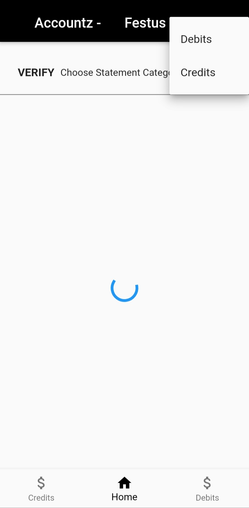
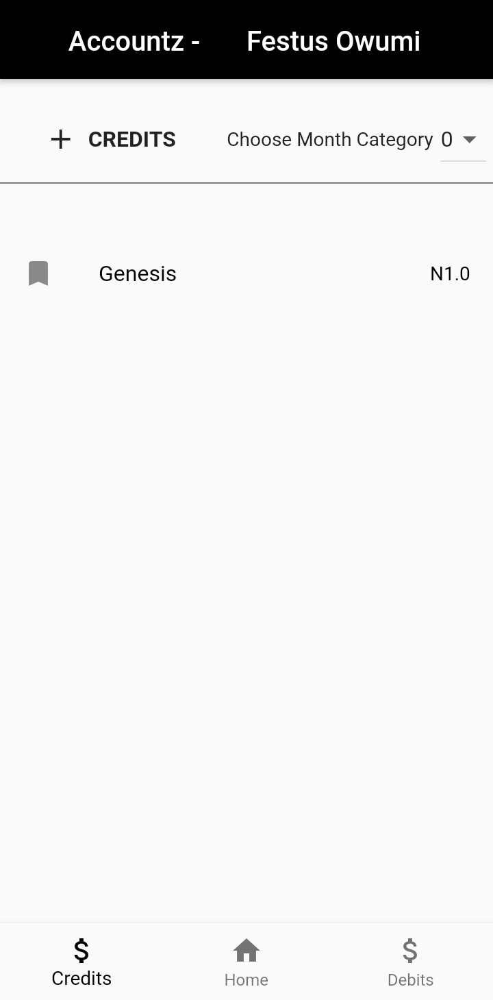
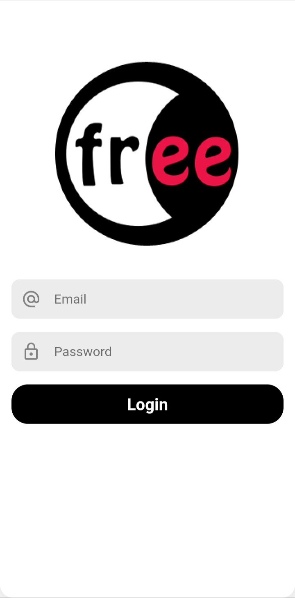

# FreeApp-Accounts-App
This is the internal accounting system for the FreeApp team. It handles and keeps track of purchases made in form of credits and debits. It has a verification feature where once a credit or debit statement has been uploaded, you can tag a team member to the debit or credit and until the team member verifies the statement, it won't be added to the total credits and debits made.

## App Screens

## Sign in screen

